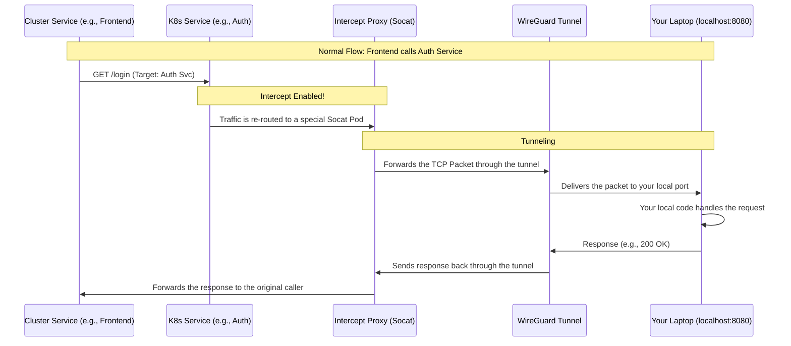

# Kloudlite Ultimate Encyclopedia: The Zero to Hero Manual

**Goal**: This document explains the Kloudlite project from the high-level architecture down to the individual file, providing a complete map for anyone, especially a new developer needing to debug a production issue at 3 AM.

---

# Volume 1: What is Kloudlite and Why Does It Exist?

## 1.1 The Big Picture

**Kloudlite** is a specialized **Cloud Development Environment (CDE)** platform. Its primary goal is to solve the "Inner Development Loop" problem for cloud-native applications.

In simple terms: It allows you to develop on your local machine while your code is connected to live cloud services (databases, other microservices) running in a **Kubernetes Cluster**. It mimics the experience of developing a monolith while working on a distributed microservices architecture.

### How is it Different?
Unlike standard **Cloud IDEs** (like GitHub Codespaces) that move your *entire* dev environment to the cloud, Kloudlite focuses on **hybrid** development. It connects your local machine to the cluster via high-performance **Tunnels**, making remote services feel like they are running on `localhost`.

### Key Features
-   **Service Interception**: "Intercept" traffic meant for a service in the cluster and route it to your local code. This lets you debug a single service in the context of the full application.
-   **Environment Management**: Every developer can have their own isolated environment (**Namespace**), so you don't step on teammates' toes.
-   **Infrastructure as Code**: It creates real Kubernetes resources, not just mocked services.

## 1.2 The "Why": Solving Real Developer Pain
1.  **The "Works on my Machine" Problem**: In a Kubernetes world, running 20+ microservices on a laptop is impossible. Kloudlite solves this by letting you run *only* the service you're editing locally, while everything else runs in the cloud.
2.  **Staging Bottlenecks**: Shared "Staging" environments are often broken. Kloudlite gives everyone their own slice of the cluster.
3.  **Speed**: It eliminates the `Code -> Commit -> CI/CD -> Deploy -> Wait -> Test` cycle. You just `Code -> Save`, and the changes are live instantly.

---

# Volume 2: Architecture & Theoretical Foundations

## 2.1 The Networking Layer (WireGuard)
The project uses **WireGuard**, a modern, high-performance VPN protocol.
-   **`kltun` (Kloudlite Tunnel)**: A CLI tool that runs on your local machine. It creates a virtual network interface that securely connects to the Kubernetes cluster.
-   **DNS Resolution**: When connected, `kltun` configures your local DNS to resolve cluster hostnames (e.g., `redis.internal`) to their internal ClusterIPs, which are then routed through the tunnel.

## 2.2 Service Interception (The "Magic")
How does traffic destined for a Pod in the cloud end up on your laptop?

1.  **The Trigger**: A developer runs `kl intercept start <service-name>`.
2.  **The Controller Action**: The `composition` controller in the cluster detects this request.
3.  **The Switch**: It modifies the Kubernetes **Deployment**, replacing the real application container with a **Proxy Container** running `socat`.
4.  **The Route**: Traffic hitting the service is caught by `socat`, forwarded through the WireGuard tunnel to your laptop.

---

# Volume 3: Detailed File Manifest

This section explains **EVERY SINGLE FILE** in the repository.

## 3.1 Root & Project Configuration (`/`)
*   **`.gitignore`**: Tells Git which files to ignore (e.g., `node_modules`, compiled binaries, secrets). Prevents accidental commits of sensitive data.
*   **`LICENSE`**: The legal terms (AGPL-3.0).
*   **`README.md`**: The landing page of the repository. The first thing a new developer reads.
*   **`Taskfile.yml`**: A modern `Makefile`. Defines commands like `task build` or `task test` used by developers and CI/CD.
*   **`nixy.yml`**: Configuration for Nix-based builds, ensuring reproducible environments.

---

## 3.2 The Backend API (`api/`)
All Go code that powers the Kloudlite platform.

### 3.2.1 Global Config (`api/`)
*   **`go.mod` / `go.sum`**: Defines the Go module and all its dependencies, ensuring reproducible builds.

### 32.2 Command Entry Points (`api/cmd/`)
Each subdirectory here compiles into a separate binary executable.

*   **`api/cmd/server/`**: **The API Server (The Brain)**.
    *   `main.go`: Initializes the Gin web server, connects to the database, and starts the main production server. If this crashes, the platform is down.

*   **`api/cmd/kl/`**: **The Developer CLI**. The tool developers run on their laptops.
    *   `main.go`: The entry point for the `kl` command.
    *   `cmd/root.go`: Defines the base `kl` command and global flags.
    *   `cmd/intercept.go`: Logic for `kl intercept start`. It finds the service in Kubernetes and tells the Operator to begin interception.

*   **`api/cmd/kli/`**: **The Installer CLI**. Used by System Admins to set up Kloudlite on a cluster.
    *   `main.go`: Entry point for `kli`.
    *   `cmd/aws.go`: AWS-specific installation logic, like checking IAM permissions.

*   **`api/cmd/kltun/`**: **The Tunnel Daemon**. The background service that maintains the VPN connection.
    *   `main.go`: Entry point for `sudo kltun daemon start`.
    *   `cmd/daemon.go`: Manages the OS-level service (systemd/launchd) to ensure the tunnel auto-restarts.
    *   `cmd/connect.go`: The handshake logic that negotiates WireGuard keys with the server.
    *   `pkg/wireguard/wireguard.go`: A wrapper around the OS network stack to create the `utun` network interface.

*   **`api/cmd/wm-ingress-controller/`**: **Workspace Ingress Controller**.
    *   `main.go`: A custom controller that watches for new Workspaces and dynamically creates Nginx ingress rules for them.

*   **`api/cmd/workmachine-node-manager/`**: A Kubernetes **DaemonSet**.
    *   `main.go`: Runs on every node in the cluster to install Nix packages (e.g., Node.js, Go) requested by workspaces.

### 3.2.3 The Operator Logic (`api/internal/controllers/`)
Code that runs *inside* Kubernetes and acts as the automation robot.

*   **`api/internal/controllers/composition/`**: Manages "Compositions" (groups of services).
    *   `intercepts.go`: **CRITICAL**. This file contains the logic that edits a Deployment to inject the `socat` proxy, effectively "stealing" traffic and routing it to the developer.
    *   `composition_controller.go`: The reconciliation loop that constantly checks, "Does the user want an intercept? Is one running?".

*   **`api/internal/controllers/environment/`**: Manages Namespaces.
    *   `environment_controller.go`: Creates the K8s Namespace for a new Environment and sets up RBAC.
    *   `pvc_copier.go`: Clones storage volumes (PVCs) when an environment is cloned.

*   **`api/internal/controllers/workspace/`**: Manages developer environments.
    *   `workspace_controller.go`: Spawns the Workspace Pod (the dev container).
    *   `networking.go`: Generates the dynamic URL for a workspace (e.g., `claude-a1b2c3d4.khost.dev`).
    *   `pod_lifecycle.go`: Handles sleeping/waking of idle workspaces to save costs.

### 3.2.4 API Internals (`api/internal/`)
The plumbing that connects the API to the Database and Kubernetes.

*   **`api/internal/server/routes.go`**: The API Router. Defines that `POST /login` goes to the login handler, etc.
*   **`api/internal/handlers/`**: The code that directly answers HTTP requests.
    *   `auth_handlers.go`: Login logic, password validation, and JWT issuance.
    *   `workspace_handlers.go`: CRUD operations for workspaces.
    *   `vpn_handlers.go`: Provides the WireGuard configuration to a connecting `kltun` client.
*   **`api/internal/services/`**: The business logic layer.
    *   `auth_service.go`: Contains the core `VerifyPassword` function.
    *   `vpn_service.go`: Generates WireGuard configs for new devices.
*   **`api/internal/webhooks/`**: Kubernetes Admission Controllers.
    *   `user_webhook.go`: Validates User CRDs, rejecting a user with an invalid email format before it's even stored.
*   **`api/internal/repository/`**: The Data Access Layer (DAL).
    *   `user_repository.go`: Wrappers around the Kubernetes client to get `User` objects.

---

## 3.3 The Frontend (`web/`)
The User Interface, built with Next.js and React.

### 3.3.1 Project Config (`web/`)
*   **`package.json`**: Defines Node.js dependencies (React 18, Next.js).
*   **`turbo.json`**: Turborepo configuration to speed up monorepo builds.

### 3.3.2 Applications (`web/apps/`)
*   **`web/apps/console/`**: The main **Admin Console** used by end-users.
    *   `src/middleware.ts`: Runs on *every* request to check for a valid session cookie, redirecting to `/login` if absent.
    *   `src/app/layout.tsx`: The root layout that wraps the entire application in global state providers (`QueryClientProvider`, `ThemeProvider`).
    *   `src/lib/api-client.ts`: The HTTP client that automatically adds the `Authorization` header to every API request.

*   **`web/apps/dashboard/`**: The **Developer Dashboard**.
    *   `src/lib/services/workspace.service.ts`: Contains frontend logic for calling the backend API to manage workspaces, separating UI from data fetching.

*   **`web/apps/website/`**: The public-facing marketing website (e.g., `kloudlite.io`).

### 3.3.3 Shared Packages (`web/packages/`)
*   **`web/packages/ui/`**: The shared Design System.
    *   `src/button.tsx`: The source code for the primary button component used across all web apps, ensuring consistency.

---

## 3.4 Kubernetes Manifests (`manifests/`)
The glue that defines Kloudlite's custom resources.

*   **`crds/workspaces.kloudlite.io_workspaces.yaml`**: The Custom Resource Definition (CRD). This file tells Kubernetes, "There is a new object type called a Workspace." Without this, the entire system wouldn't work.
*   **`crds/machines.kloudlite.io_workmachines.yaml`**: The CRD for WorkMachines, which define the VM-like environments that host workspaces.

---

**End of Encyclopedia.**
You now have a map of the entire Kingdom, from the CLI in your terminal to the Webhook in the Cluster.